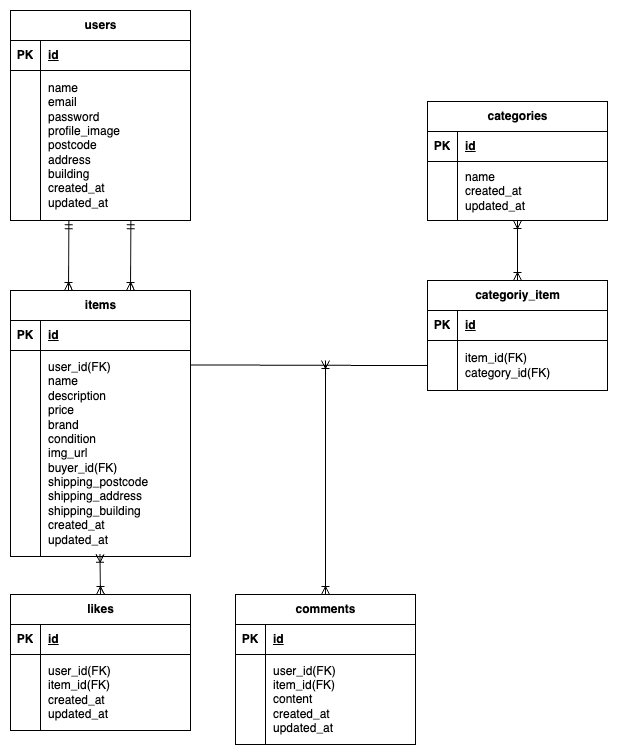

# coachtechフリマ

## 環境構築

### Dockerビルド
・git clone https://github.com/Mantis4590/laravel-fleamarket.git  
・cd laravel-fleamarket  
・docker-compose up -d --build

### Laravel環境構築
・docker-compose exec php bash  
・composer install  
・cp .env.example .env　# 環境変数をコピーして設定  
・php artisan key:generate  
・php artisan migrate  
・php artisan db:seed  
・php artisan storage:link

### 開発環境URL
・トップページ：http://localhost/  
・会員登録：http://localhost/register  
・ログイン：http://localhost/login  
・phpMyAdmin：http://localhost:8080  
・MailHog（メール確認用）：http://localhost:8025

## 使用技術（実行環境）
・PHP 8.1.x  
・Laravel 8.x  
・MySQL 8.0.x  
・nginx 1.21.x  
・Docker/docker-compose  
・MailHog  
・Stripe API（決済機能）

## ER図
